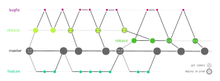

# A Git Branching Model for SaaS

* [In a Nutshell](#in-a-nutshell)
* [Rules](#rules)
  * [Release Life Cycle](#release-life-cycle)
  * [Major Releasees](#major-releases)
  * [Patch Releasees](#patch-releases)
* [Discussion](#discussion)
  * [Assumptions](#assumptions)
  * [Version Naming Scheme](#version-naming-scheme)
  * [State of the Art](#state-of-the-art)
  * [What problems does the proposed model solve?](#what-problems-does-the-proposed-model-solve)

## In a Nutshell

  

This document describes a git branching and release management model for
continuously delivered SaaS. This model is very close in spirit
to two alternatives you might already know:
[gitflow](https://nvie.com/posts/a-successful-git-branching-model/) and
[oneflow](https://www.endoflineblog.com/oneflow-a-git-branching-model-and-workflow).

The advantages of this model are:

* simpler than gitflow,
* smoother workflow for maintenance (hotfixes) compared to both gitflow and
  oneflow,
* tuned to the requirements of continuously delivered SaaS.

The diagram above describes the [rules](#rules) of the proposed
model. This repository itself has followed these rules; see the [demo](/demo.md)
document to see the sequence of events and a visualized history of this
example repository.

## Rules

The big assumption I make is:

__At any given moment there is only one version in production.__

And the overarching guiding principle I have followed is:

__Set up your process in a way that makes it easy to do things you wish to do regularly.__

I want a git and release process that encourages:

* commit early and push often,
* code review of all new development (features or bug fixes),
* nothing rolled out to production without tests and QA in a staging environment,
* short release cycles,  possibly to the point of continuous deployments,
* agile application of urgent bug fixes to production.

### Release Life Cycle

Central to the model is the stages in the life cycle of each release. Each stage
corresponds to a unique git commit, tagged with an appropriate version number.
The stages of the release life cycle are separated by various activities, e.g.
bug fixes, staging and QA, etc. In each step, I have included an example git tag
that labels each release stage, more on this [below](#version-naming-scheme).

Each release, say v1, begins from a snapshot of master as a __release
candidate__ v1.0-rc1. During the __QA__ process issues are identified and
fixed. At each round a new release candidate is created: v1.0-rc2, v1.0-rc3,
....  After QA the release is __rolled out__ to production as a __major
release__ v1.0 corresponding to the final, approved major release candidate
v1.0-rc5.

Until the end of its life, the release may go through a number of __patch
releases__ v1.1, v1.2, ..., each of which addresses an urgent issue in
production that cannot wait until the next major release. Each patch release is
QAed and rolled out to production in a similar way as the original major
release. For example, the patch release v1.1 starts off as a release candidate
v1.1-rc1, and graduates to being rolled out at some later release candidate,
v1.1-rc4, finally superseding v1.0 in production. Patch releases go on until the
next major release roll out.

### Branches

There is one __eternal branch__, the active branch, __master__.

#### Release Branches

Each release has its __dedicated release branch__ (release/v1) which lives
from the time you start preparing the major release, throughout QA, and as long
as that release is in production.

The starting commit of a release branch is the first major release candidate
which is merely a snapshot of master  v1.0-rc1.  Every time a major or
patch release is rolled out to production, the corresponding tag on the release
branch (v1.0, v1.1, v1.2, ...) is merged back into master.

The moment the next major release v2.0 is rolled out to production, the
old release branch release/v1 becomes defunct and the new release branch
release/v2 becomes the current release branch.

#### Temporary Branches

All __feature development__ and __bug fixes__ happen on temporary branches that
start from and merge into some target branch:
* during normal course of development, the source and target branch is master,
* for release prep and maintenance fixes (from v1.0-rc1 through v1.4) the
  source and target branch is the current release branch.

### Major Releases

* __Tag and Stage__: tag a commit on master as the release candidate, e.g.
  v1.0-rc1. Deploy the release candidate to a staging environment
* __Release Prep__: repeat the following until ready to roll out to prod.
  * Start a dedicated release branch for the upcoming major release, e.g.
    release/v1, starting from the first release candidate v1.0-rc1
  * Test and QA the staging environment, identify issues.
  * Solve each individual issue identified in QA, work on a temporary fix
    branches that start from and merge back into the release branch.
  * __Tag and Stage__: once all fix branches are merged back into the release
    branch release/v1 tag a new release candidate (v1.0-rc2, v1.0-rc3, ...) and
    deploy to staging again.
* __Tag, Roll out, and Merge__: once a release candidate (v1.0-rc4) is
  confirmed to be ready for production, tag it as the major release v1.0, roll
  it out to production, and merge it back into master.

### Patch Releases

Exactly the same as preparing a major release, except for the very last step:

* __Update Prep__: repeat the following until ready to roll out to prod.
  * Solve issues on temporary fix branches that starts from and merges back
    into the release branch, e.g. release/v1.
  * __Tag and Stage__: once all fix branches are merged back into the release
    branch release/v1 tag a new release candidate (v1.1-rc1) and deploy
    to staging again.
* __Tag, Roll out, and Merge__: once a release candidate (v1.1-rc3) is
  confirmed to be ready for production, tag it as the patch release v1.1,
  roll it out to production, and merge it back into:
  * master, or
  * the next release branch release/v2 if this patch release is happening
    at a time when the next major release v2.0 is being prepared.

## Discussion

### Assumptions

I make the following assumptions about your deployments:

* __There is one and only one production version of your system at all times__.
  The emphasis here is on version, i.e. if you have multiple instances of your
  production environment (e.g. for different clients) but they are all always at
  the same version, this document is for you. If you need to maintain multiple
  versions of your system, first, try to avoid that, and second, note that the
  model described here has the same limitations as gitflow and oneflow when
  dealing with multiple maintained versions. You simply need a different
  workflow for release maintenance.
* It is relatively easy, and ideally automatic, for your team to deploy a
  given state of code (i.e. a git commit) to a new or existing, staging or
  production environment.
* Performing integration and/or manual QA tests on a staging environment is
  the definitive last step confirming that __the exact version__ deployed to
  staging can be rolled out to production.
* A deployed state of your system might require multiple components to be
  deployed which might live in different git repositories. For example, your
  deployments might involve three git repositories:
  1. repo X: internal REST server,
  2. repo Y: docker images used in a computational pipeline,
  3. repo Z: user-facing web app which relies on specific version of the
     internal REST server and specific versions of built docker images.

  In this scenario, deployment means deploying the right version of each of
  these repos.  But if you are only dealing with a single repository, the model
  described here does not add unnecessary complexity to your workflow.

### Version Naming Scheme

You can use whatever versioning and branch-naming scheme you like. Here is what
I have used in this repository for providing examples.  Versions have a major
release number and a patch number, e.g. v1.4 (major release 1, maintenance
update 4). This is a simplified semantic versioning scheme, excluding the minor
version for simplicity.  Each release involves rolling out a new major release
which starts with patch number 0, e.g. v4.0.  Any updates to a live release,
increases its patch number, e.g. from v4.0 to v4.1. The next release must bump
up the major release number and reset the patch number to zero, e.g. from v4.5
to v5.0. In contrast, the patch number is an important signifier in the examples
I have given here: it tells you that a fix being applied to a release branch is
a "hotfix" and therefore should follow the rules of hotfixes.

#### Versioning and SaaS

Semantic versioning (i..e `<major>.<minor>.<patch>`) is great for distributed
software where inter-operability and backwards/migration compatibility of
_arbitrary pairs of versions_ is important. In SaaS, if you only ever have
one production version at all times, you never have to worry about the
compatibility between _arbitrary_ version pairs; you only need to worry
about migrating from each version to the single version that immediately
follows it, e.g. from v12.3 to v13.0, or from v13.0 to v13.1, but not from v9.2
to v13.4). This means that the distinction between major version changes and
minor version changes is a lot less meaningful and significant in SaaS than it
is in distributed software. This is even more true if you aspire to deliver
continuously.

### State of the Art

There are three scenarios that all git branching models (this one included) want
to deal with:

* normal course of development,
* releases,
* maintenance between releases (hotfixes).

### Normal course of development

Normal course of development means the day-to-day process of building new
features, fixing non-urgent bugs, paying back technical debt, etc. as long as it
does not relate to the release process. There is no debate here among different
branching models:

* All development happens on __temporary branches__ dedicated to the task,
* There is a designated __long-living active branch__ (be it develop or master) where
  all said temporary branches branch from and merge into.

### Releases

All models also agree on how a release should _start_:

1. you pick a commit in the active branch,
1. call it your release candidate (e.g. v1.0-rc1), and deploy to a staging
   environment,
1. from the rc1 commit, start a new branch, say release/v1, dedicated to the
   v1 release and only allow bug fixes _for that release_ into that branch.
1. all bug fixes for the release branch off of the release branch and merge back
   into the release branch,
1. Every time you think you have a good release candidate, you deploy a new
   version, e.g. v1.0-rc2, to a staging environment for integration testing
   and manual QA.

This process frees the active branch to continue to serve its duty as the source
and target for normal development. During a release period this is for all new
development that will _not_ be part of the currently prepared release.

Once you have your final release candidate and are ready to deploy to
production, that's where all the disagreements between git branching models starts:

* What should happen to the release branch?
* How should the bug fixes from the release process be brought into the active
  branch?
* How should maintenance updates to the deployed release ("hotfixes") be
  applied?
* How should hotfixes be brought to the active branch so that upcoming releases
  do not re-introduce the fixed bug?
* How do all of the above need to change if a hotfix to prod is necessary in the
  middle of the next release cycle?

### Long-living branches

A big source of complexity in any git branching model is the number and the
relationships between different branches. The sweet spot for almost every one I
know is to use branches often and to merge them into a target branch regularly.
The cognitive burden kicks in when you have multiple long-living branches that
do not eventually, or frequently, merge into a target branch and dissolve.

For example, in gitflow:
* there are two long-living branches (__master__ and __develop__)
* release, feature, and bugfix branches are temporary.
* normal feature branches start from and merge back into the active branch
  develop.
* release branches start from the active branch, get polished and tested, and
  merge into master, the "prod" branch.
* it is in the prod branch master that final released versions get tagged,
  e.g. v1.0.
* bugfix branches start from the prod branch master, and merge back into prod
  _and_ separately into the active branch develop.

Oneflow on the other hand, recognizes the cognitive burden of having to deal
with two long-living branches and the added history complexity of all these
inter-branch logic. Instead, in oneflow:
* there is only __one long-living branch__, the active branch master.
* feature branches start from and merge back into the active branch master.
* release branches start from and merge back into the active branch master.
* it is on the release branch that final released versions get tagged, e.g.
  v1.0.
* once a release is rolled out, the release branch is defunct.
* all hotfixes are dealt with on ad-hoc temporary branches, which is where patch
  releases, e.g. v1.1, are tagged.
* hotfix branches are merge directly back into the active branch master.

### What problems does the proposed model solve?

#### Prod branch is not worth it

The prod branch in gitflow adds more complexity than it absorbs. The value it
provides is:
* a way to cleanly get exact versions that are deployed to production. But
  this is easily achieved by git tags, this is what oneflow does.
* a protocol for calling a release branch done when it's deployed to
  production: by merging it into the prod branch master. But this, too, is
  easily achieved by git tags, this is again what oneflow does.

This comes at the expense of the following inconveniences:
* __complex commit network__: this is just unnecessarily cognitive burden of
  holding a nontrivial graph in your head when you have two long-living branches
  with complex interactions between them (e.g. releases start from develop and
  merge into in master while hotfixes start from master and merge into master
  _and_ develop).
* __no branch that includes all history__: release candidates, e.g. v1.0-rc1,
  are on develop and final released candidates, e.g. v1.0, are on master. It
  would be nice to be able to do have a single branch where git log would
  include both v1.0-rc1 and v1.0.
* __superfluous merge commits pulled in by hotfixes__: merging every hotfix back
  into the active branch (develop) pulls in a bunch of superfluous merge commits
  (just follow through a hotfix in the standard diagram). A multi-branch
  workflow already has some readability overhead associated with merge commits;
  let's not make it a lot worse!

__Resolution__: accept the solution provided by oneflow to this problem; just
get rid of the prod branch and use git tags.

#### Release maintenance is clunky

Release maintenance is clunky in both gitflow and oneflow. In gitflow, you are
supposed to merge a hotfix branch into both master and develop. First, this
is error prone and unnecessarily complex. Second, when a gitflow hotfix branch
is merged into the active branch, develop, it brings with a bunch of superfluous
and confusing merge commits _from master_.

Oneflow, instead, suggests that you review, test, and deploy hotfixes on their
dedicated temporary branch and then merge them into the active branch. The
problem with this model is that it is putting too much responsibility on the
hotfix branch: code review, staging, and final deployment all need to happen on
an ephemeral bugfix branch. This is because applying hotfixes does not follow
the same workflow as rolling out and testing normal releases which involve:
* dedicated target branch, i.e. the release branch,
* merging a fix to the release branch does _not_ mean production is updated; it
  just means that the proposed fix has been reviewed and checked in.
* a protocol for tagging and deploying release candidates to staging
  environment,
* a protocol for deploying a final release candidate to production and merging
  it back.

##### Resolution

__Extend the lifecycle of release branches until the next major release__. This
means that, unlike in oneflow, release branches don't go defunct once they have
been deployed to production. Instead they stay alive for the purpose of serving
as the source and target branch for all maintenance work on the major
release currently in production.

This also ensures that the workflow for fixing a pre-release issue that say
takes the release branch from v1.0-rc1 to v1.0-rc2 and then v1.0 is %100
identical to the post-release maintenance workflow for fixing an issue in v1.0:
* bug fix branch starts from and merges into the release branch,
* a new release candidate v1.1-rc1 is staged and tested,
* test and QA, possible further fixes, stage, repeat,
* at some point some v1.1-rc4 is ready to be rolled out and it becomes v1.1
  and is deployed to production.
* the release branch is once again merged into the active branch master.
