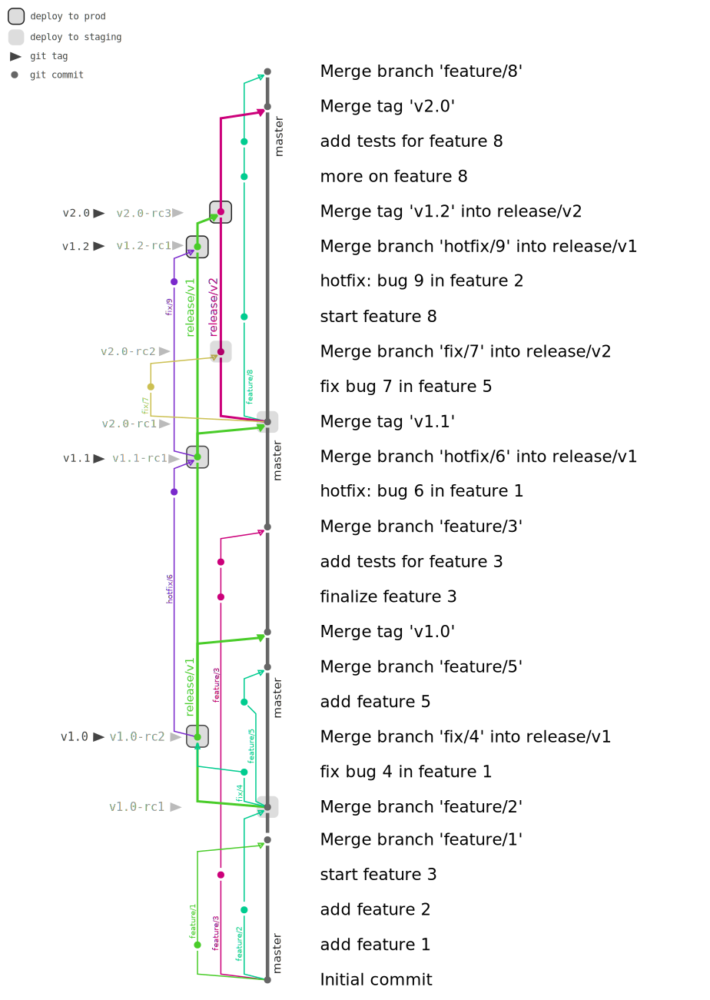

## Demo

This document walks you through all the steps that have produced the current
state of this repository. This is intended to be a toy version of real world
scenarios that the git branching model proposed here addresses.

<p align="center">  </p>

### Normal development

Start work on feature 1 in a short-lived branch, source and target is master:
```sh
             $ git checkout master
    (master) $ git checkout -b feature/1
 (feature/1) $ git add feature-1.txt
 (feature/1) $ git commit -m 'add feature 1'
```

Start work on feature 2 in a short-lived branch, source and target is
master):
```sh
             $ git checkout master
    (master) $ git checkout -b feature/2
 (feature/2) $ vim feature-2.txt
 (feature/2) $ git add feature-2.txt
 (feature/2) $ git commit -m 'add feature 2'
```

Start work on feature 3 in a short-lived branch, source and target is
master:
```sh
             $ git checkout master
    (master) $ git checkout -b feature/3
 (feature/3) $ vim feature-3.txt
 (feature/3) $ git add feature-3.txt
 (feature/3) $ git commit -m 'start feature 3'
```

After code review and testing, merge feature 1 and feature 2:
```sh
             $ git checkout master
    (master) $ git merge --no-ff feature/1
    (master) $ git merge --no-ff feature/2
```

### Start v1 release

Start __major release v1__:
```sh
             $ git checkout master
    (master) $ git tag v1.0-rc1
    (master) $ git checkout -b release/v1
(release/v1) $ make deploy-staging
```

### Fix bugs in staging v1 release

Fix bug 4 identified in QA of release candidate v1.0-rc1, source and target
branch is release/v1:
```sh
             $ git checkout release/v1
(release/v1) $ git checkout -b fix/4
     (fix/4) $ vim feature-1.txt
     (fix/4) $ git add feature-1.txt
     (fix/4) $ git commit -m 'fix bug 4 in feature 1'
```

After code review and testing, merge fix for bug 4, __tag and stage__ a new
release candidate v1.0-rc2 for v1.0:
```sh
             $ git checkout release/v1
(release/v1) $ git merge --no-ff fix/4
(release/v1) $ git tag v1.0-rc2
(release/v1) $ make deploy-staging
```

### Normal development continues

Start work on feature 5 in a short-lived branch, source and target is
master:
```sh
             $ git checkout master
    (master) $ git checkout -b feature/5
 (feature/5) $ vim feature-5.txt
 (feature/5) $ git add feature-5.txt
 (feature/5) $ git commit -m 'add feature 5'
```

After code review and testing, merge feature 5, this will not be part of the
ongoing release v1:
```sh
             $ git checkout master
    (master) $ git merge --no-ff feature/5
```

### Finish v1 release

Back in release land: the latest release candidate has been vetted, __tag,
roll out, and merge__ back into master:
```sh
             $ git checkout release/v1
(release/v1) $ git tag v1.0
(release/v1) $ make deploy-prod
(release/v1) $ git checkout master
    (master) $ git merge --no-ff v1.0
```

### Normal development continues

Continue work on feature 3 on its feature branch:
```sh
             $ git checkout feature/3
 (feature/3) $ vim feature-3.txt
 (feature/3) $ git add feature-3.txt
 (feature/3) $ git commit -m 'finalize feature 3'
 (feature/3) $ vim feature-3.txt
 (feature/3) $ git add feature-3.txt
 (feature/3) $ git commit -m 'add tests for feature 3'
```

After code review and testing, merge feature 3:
```sh
             $ git checkout master
    (master) $ git merge --no-ff feature/3
```

### Hotfix for v1 release

An urgent bug has been identified in production. Start working on it on a
short-lived hotfix branch, source and target is the current release branch
release/v1:
```sh
             $ git checkout release/v1
(release/v1) $ git checkout -b hotfix/6
  (hotfix/6) $ vim feature-1.txt
  (hotfix/6) $ git add feature-1.txt
  (hotfix/6) $ git commit -m 'fix bug 6 for feature 1'
```

After code review and testing, merge fix for bug 6, __tag and stage__ a new
release candidate v1.1-rc1 for the upcoming maintenance version v1.1:
```sh
             $ git checkout release/v1
(release/v1) $ git merge --no-ff hotfix/6
(release/v1) $ git tag v1.1-rc1
(release/v1) $ make deploy-staging
```

After QAing the release candidate, roll out to production, tag and merge back
into master:
```sh
             $ git checkout release/v1
(release/v1) $ git tag v1.1
(release/v1) $ make deploy-prod
(release/v1) $ git checkout master
    (master) $ git merge --no-ff v1.1
```

### Start v2 release

__Tag and stage__:
```sh
             $ git checkout master
    (master) $ git tag v2.0-rc1
    (master) $ git checkout -b release/v2
(release/v2) $ make deploy-staging
```

Fix a bug identified in QAing the staged version, source and target branch is
release/v2:
```sh
             $ git checkout release/v2
(release/v2) $ git checkout -b fix/7
     (fix/7) $ vim feature-5.txt
     (fix/7) $ git add feature-5.txt
     (fix/7) $ git commit -m 'fix bug 7 in feature 5'
```

After merging bug fix, __tag and stage__:
```sh
             $ git checkout release/v2
(release/v2) $ git merge --no-ff fix/7
(release/v2) $ git tag v2.0-rc2
(release/v2) $ make deploy-staging
```

### Normal development continues

Start work on feature 8 in a short-lived branch, source and target is master:
```sh
             $ git checkout master
    (master) $ git checkout -b feature/8
 (feature/8) $ git add feature-8.txt
 (feature/8) $ git commit -m 'add feature 8'
```

## Hotfix for v1 release while v2 is being prepped

An urgent bug has been identified in production. Start working on it on a
short-lived hotfix branch, source and target is the current (live) release
branch release/v1:
```sh
             $ git checkout release/v1
(release/v1) $ git checkout -b hotfix/9
  (hotfix/9) $ vim feature-2.txt
  (hotfix/9) $ git add feature-2.txt
  (hotfix/9) $ git commit -m 'fix bug 9 for feature 2'
```

After code review and merging the fix, __tag and stage__:
```sh
             $ git checkout release/v1
(release/v1) $ git merge --no-ff hotfix/9
(release/v1) $ git tag v1.2-rc1
(release/v1) $ make deploy-staging
```

Once staging QA of v1.2 is done, __tag, roll out, and merge__, but note that the
merge destination is the currently ongoing (in-prep) release branch release/v2:
```sh
(release/v1) $ git tag v1.2
(release/v1) $ make deploy-prod
(release/v1) $ git checkout release/v2
(release/v2) $ git merge --no-ff v1.2
```

Now that there is new code in release/v2, __tag and stage__:
```sh
             $ git checkout release/v2
(release/v2) $ git tag v2.0-rc3
(release/v2) $ make deploy-staging
```

Once staging QA of v2.0 is done, __tag, roll out, and merge__:
```sh
             $ git checkout release/v2
(release/v2) $ git tag v2.0
(release/v2) $ make deploy-prod
(release/v2) $ git checkout master
    (master) $ git merge --no-ff v2.0
```

### Normal development continues

Continue work on feature 8:
```sh
             $ git checkout feature/8
 (feature/8) $ vim feature-8.txt
 (feature/8) $ git add feature-8.txt
 (feature/8) $ git commit -m 'more on feature 8'
 (feature/8) $ vim feature-8.txt
 (feature/8) $ git add feature-8.txt
 (feature/8) $ git commit -m 'add tests for feature 8'
```

Once reviewed, feature 8 is merged. This will be part of the next major release
v3.
```sh
             $ git checkout master
    (master) $ git merge --no-ff feature/8
```
